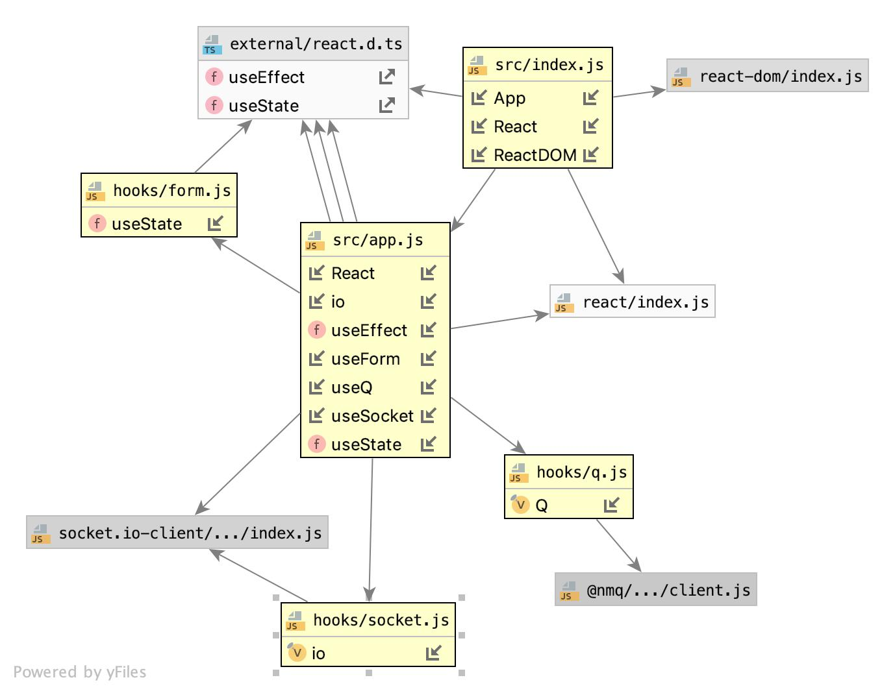

# LAB - 32

## Hooks

### Author: Jessica Walters

### Links and Resources
* [submission PR](https://github.com/401-advanced-javascript-jessica/401-lab-32-practice/pull/2)
* [travis](https://www.travis-ci.com/401-advanced-javascript-jessica/401-lab-32-practice)
* [Amplify](https://master.d253588owotkys.amplifyapp.com/)

#### Documentation
* [styleguide](localhost:6060)

### Components
#### `app.js`

### Setup

#### Running the app
* `npm run start`
  
#### Tests
* `npm run test`

#### UML

